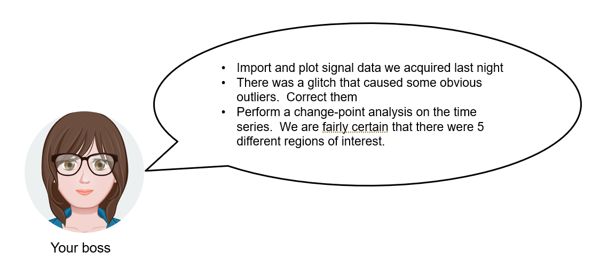
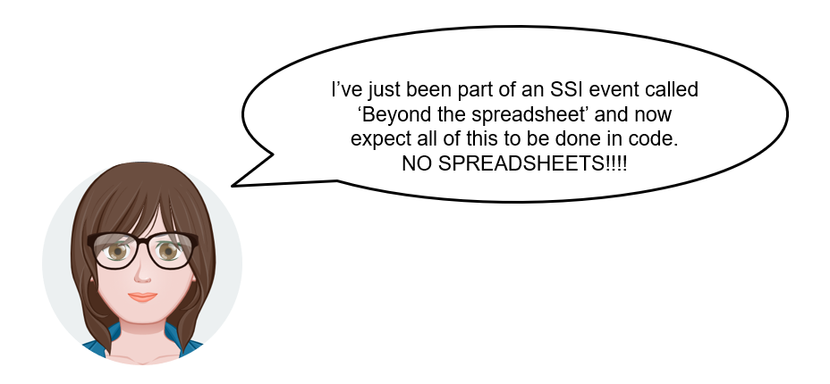

# The art of coding without coding with MATLAB

You're going about your day in the lab, analysing and collecting data, writing papers and drinking coffee when your PI sends you a message.

"No problem", you think, "I've got a spreadsheet built by the last postdoc who worked here, it'll take care of that no problem. We've been using it for years."

uh oh!

# You have a problem that can be solved by coding, now you have two problems

When someone has invested a lot of time into learning a computational tool, telling them that it is wrong and that they should do something else entirely is not necessarily helpful.  Even if you are right, all you've really done is given them a new problem.  In this case that problem is **learn to code**.  

**Learn to code** is good advice but it's also important for many people that they remain as productive as possible while doing it.  Ideally you'll be able to ease yourself gently into this new way of doing things, learn a little bit at a time, remain productive and receive guidance as you go.
