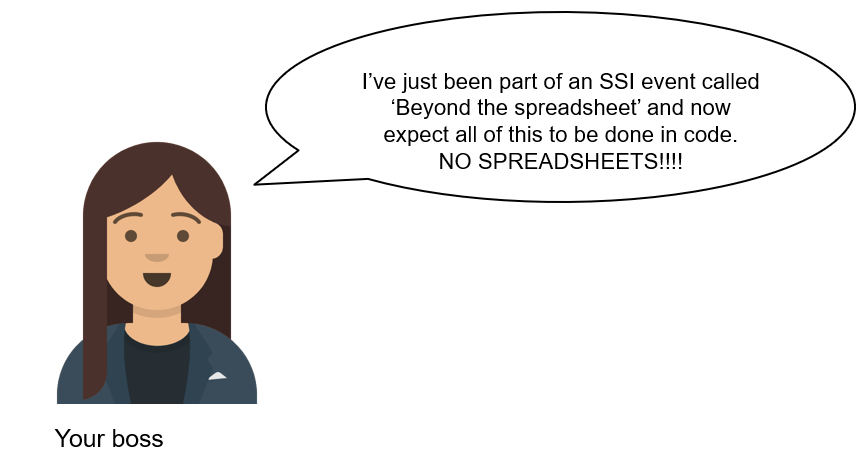
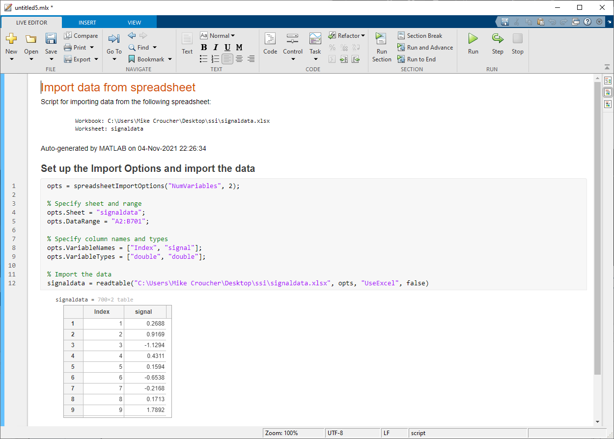
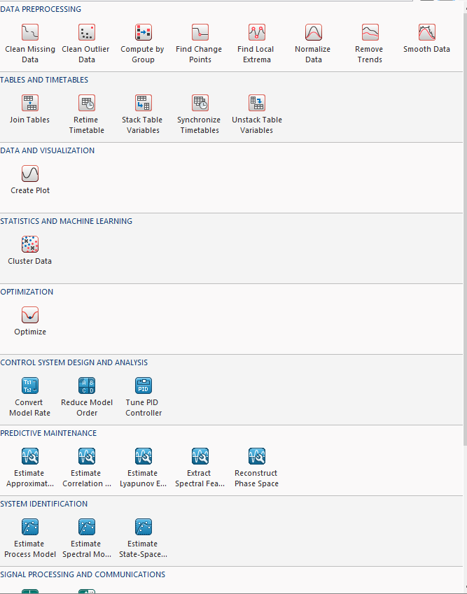
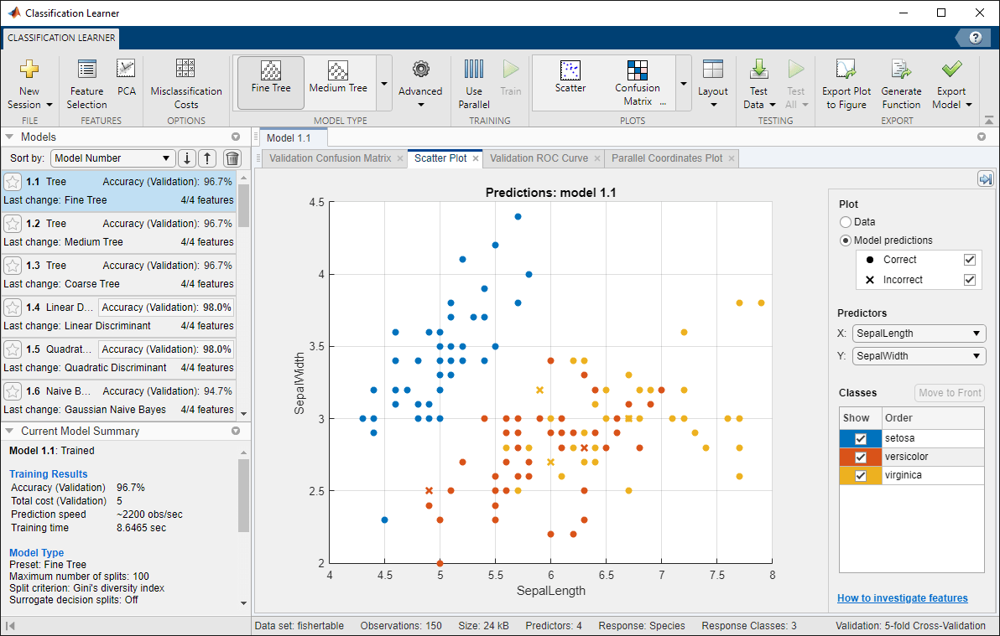
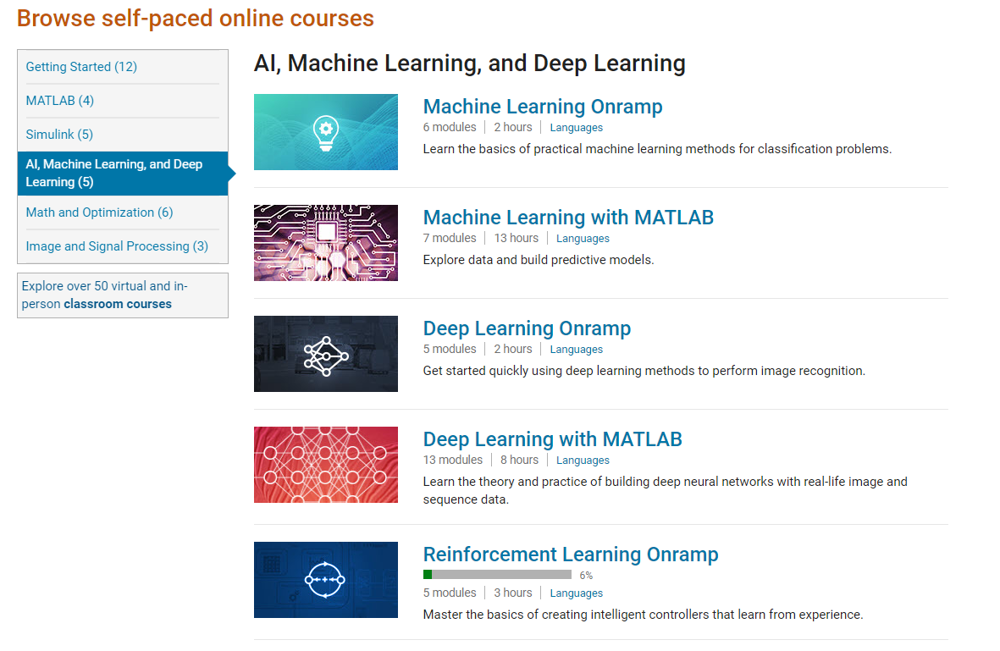

# The art of coding without coding with MATLAB Live tasks

You're going about your day in the lab, analysing and collecting data, writing papers and drinking coffee when your PI sends you a message.

"No problem", you think, "I've got a spreadsheet built by the last postdoc who worked here, it'll take care of that no problem. We've been using it for years."

uh oh!

# "Just" Learn to code

When someone has invested a lot of time into learning a computational tool, telling them that it is a bad tool and that they should do something else entirely is not necessarily helpful.  Even if you are right, all you've really done is given them a set of new problems.  In this case one of those new problems is **learn to code**.  

'**Learn to code**' is good advice but its difficulty should not be underestimated.  Learning to code is a time-consuming affair (some might say never-ending) and in an ideal world we would always be productive while learning.  

The MATLAB ecosystem supports you at every level of your programming career, even when you've never written a single line of code in your life. 

## Importing the spreadsheet and generating our first Live Script

There are few things more daunting to a new programmer than an empty command prompt and your mind may be full of questions.  Where can I find help?  How can I learn how to program in this language?  Is there anyone I can talk to to help me further, either from [MathWorks support](https://uk.mathworks.com/support.html) or the [MATLAB user community](https://uk.mathworks.com/matlabcentral/answers/index)?  

With MATLAB, the answer to these questions are just a click away in the resources tab.

Today, however, we are just going to dive right in.  We need to import some data so let's click on the **Import Data** tab and select our spreadsheet.

This opens the Import tool which gives a preview of the spreadsheet and a whole bunch of options we can select.  Everything seems OK with this very simple, two column spreadsheet so we'll not change any of the automatically detected options.  Instead we'll click on **Import Selection** and choose **Generate Live Script**

The result is a [Live Script](https://uk.mathworks.com/help/matlab/live-scripts-and-functions.html) which combines text, code and results into one interactive document.  The code is commented and our report has begun.  We've done something useful, solved the blank-page problem and are on our way to solving the larger problem at hand.

## Live tasks -- the art of coding without coding

One of the first things anyone does after importing some data is plotting it.  As with importing, this is such a common task that MATLAB provides additional assistance for those who want it.

Click on the part of the Live Script where you'd like to add your plotting code and then click on **Insert** -> **Task**

You'll see a list of tasks that will vary according to which selection of MATLAB toolboxes you have installed.  Here I have tasks ranging from plotting and outlier removal (included in base MATLAB) through to more specialist things such as clustering and Audio Feature Extraction whichh are part of additional toolboxes. 

I choose the **Create Plot** task and the graphical user interface (GUI) is loaded where I want the code to appear.  One of the great things about this task is that it shows the wide range of plot types available in MATLAB -- a great way of discovering what is possible.  Here, however, I am going to take the simple route and produce a basic plot.

Finally, we generate editable code:

A little more editing of the live script to turn the code comment into a section title and we are done for now.

You can achieve quite a lot with Live Tasks and MathWorks are adding more features all the time.  Indeed, it's possible to solve all of the problems set by our boss at the beginning of this post using nothing but Live Tasks.  Give it a try and compare your results with the solution I came up with here.

* Solution Live script generated using Live Tasks: [Live Script](./live_tasks.mlx), [HTML version](./live_tasks.html)

## Apps: For more complex workflows

Even when you are very comfortable with programming, Live Tasks can really help with the exploration phase of many projects but they are just the beginning of your journey into a larger world. For more complicated workflows such as [Classification](https://uk.mathworks.com/help/stats/classificationlearner-app.html), [Video Labelling](https://uk.mathworks.com/help/vision/ref/videolabeler-app.html) and [Deep Learning Network design](https://uk.mathworks.com/help/deeplearning/ref/deepnetworkdesigner-app.html), MATLAB and its ecosystem of toolboxes have a [large number of fully featured apps](https://uk.mathworks.com/help/referencelist.html?type=app), often including code generation. 

Alongside those produced by MathWorks there are [many more open source apps built by the community](https://uk.mathworks.com/matlabcentral/fileexchange/?type%5B%5D=apps), all just a few clicks away via the MATLAB Add-Ons button.

## Training: Take your next steps

Live Tasks and Apps can get you pretty far with solving your problems and learning to code by example but sooner or later you are going to need to learn the details.  MathWorks have you covered here as well with dozens of courses ranging from a [2 hour MATLAB on-ramp](./https://uk.mathworks.com/learn/tutorials/matlab-onramp.html) which teaches you the foundations right up to in depth courses on machine learning, reinforcement learning, image processing and many more.

 

If you are a member of one of the >2000 universities with a campus wide license, all of these training courses are freely available to you and many of the shorter OnRamps are available to everyone with a [free MathWorks account](https://uk.mathworks.com/login). 
