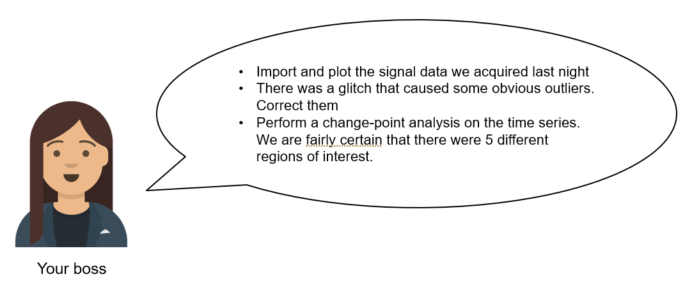

# The art of coding without coding with MATLAB

You're going about your day in the lab, analysing and collecting data, writing papers and drinking coffee when your PI sends you a message.

"No problem", you think, "I've got a spreadsheet built by the last postdoc who worked here, it'll take care of that no problem. We've been using it for years."

uh oh!

# You have a problem that can be solved by coding, now you have two problems

When someone has invested a lot of time into learning a computational tool, telling them that it is a bad tool and that they should do something else entirely is not necessarily helpful.  Even if you are right, all you've really done is given them a set of new problems.  In this case one of those new problems is **learn to code**.  

'**Learn to code**' is good advice but its difficulty should not be underestimated.  Learning to code is a time-consuming affair (some might say never-ending) and in an ideal world we would always be productive while learning.  

The MATLAB ecosystem supports you at every level of your programming career, even when you've never written a single line of code in your life. 

## Importing the spreadsheet and generating our first Live Script

There are few things more daunting to a new programmer than an empty command prompt and your mind may be full of questions.  Where can I find help?  How can I learn how to program in this language?  Is there anyone I can talk to to help me further, either from MathWorks support or the MATLAB user community?  With MATLAB, the answer to these questions are just a click away in the resources tab.

Today, however, we are just going to dive right in.  We need to import some data so let's click on the import data tab.

